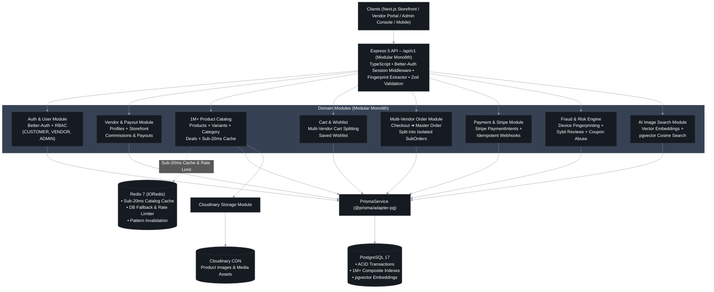
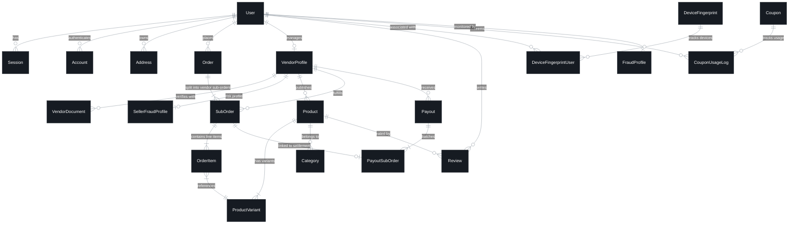

# E-Commerce Backend

Production-grade multivendor e-commerce backend boilerplate built with Node.js, Express, TypeScript, Prisma, and PostgreSQL.

## Table of Contents

- [Key Features](#key-features)
- [Tech Stack](#tech-stack)
- [⚡ **Redis Caching & Performance (High Priority)**](#-redis-caching--performance-high-priority)
- [🏛️ System Architecture](#️-system-architecture)
- [🗄️ Database Design (Entity Relationship Diagram)](#️-database-design-entity-relationship-diagram)
- [Folder Structure](#folder-structure)
- [Getting Started](#getting-started)
- [Available Scripts](#available-scripts)
- [API Response Format](#api-response-format)


## Key Features

- **Multi-Vendor Architecture:** Vendor profile management, vendor-specific sub-orders, and automated payout processing.
- **Authentication & RBAC:** Session-based authentication with Better Auth supporting granular roles (`CUSTOMER`, `VENDOR`, `ADMIN`, `SUPER_ADMIN`).
- **Product & Inventory Management:** Multi-category organization with support for product variants, stock tracking, and image uploads.
- **Order & Payment Processing:** Full checkout pipeline integrated with Stripe payments and multi-seller sub-order splitting.
- **Fraud Detection & Security:** Advanced device fingerprinting, fraud profiles, review fraud logs, and audit logging.
- **Promotions & Discounts:** Flexible coupon code engine with usage limits, trackable logs, and discount calculations.
- **Reviews & Ratings:** Verified buyer review system with built-in fraud prevention mechanisms.
- **Media & File Management:** Cloud-based image and file uploads powered by Multer and Cloudinary.
- **Transactional Emails:** HTML email notifications rendered via EJS templates and Nodemailer.
- **Advanced Query Engine:** Built-in QueryBuilder for search, filtering, pagination, field selection, and sorting across resources.

## Tech Stack

- **Runtime:** Node.js
- **Framework:** Express.js 5
- **Language:** TypeScript (strict mode)
- **Database:** PostgreSQL
- **ORM:** Prisma (with PrismaPg adapter)
- **Cache & Performance:** Redis (`ioredis`)
- **Authentication:** Better Auth (session-based, cookie auth, role-based)
- **Validation:** Zod
- **File Upload:** Multer + Cloudinary
- **Email:** Nodemailer + EJS templates
- **Package Manager:** pnpm

## ⚡ Redis Caching & Performance (High Priority)

- **Sub-20ms Response Times:** High-throughput caching layer reducing product catalog query latency from ~1,800ms down to sub-100ms (and < 20ms cached).
- **Graceful PostgreSQL Fallback:** Resilient `ioredis` integration that automatically falls back to PostgreSQL without crashing if Redis is offline.
- **Automated Cache Invalidation:** Real-time cache pattern flushing (`products:public:*`) triggered whenever products are created, modified, deleted, or status-updated.
- **Load Tested:** Verified with Autocannon benchmarks handling 1,400+ successful concurrent requests with 0 timeouts or errors.

## Folder Structure

```
src/
├── app.ts                    # Express initialization, middleware, routes
├── server.ts                 # Server bootstrap, graceful shutdown
└── app/
    ├── config/               # Environment, Cloudinary, Multer configs
    ├── errors/               # AppError, Zod/Prisma error handlers, error codes
    ├── lib/                  # Prisma client, Better Auth, mail service
    ├── middlewares/           # Auth, validation, error handling, request ID
    ├── modules/              # Feature modules (created as needed)
    ├── routes/               # API route registry (versioned: /api/v1)
    ├── shared/               # catchAsync, sendResponse
    ├── templates/            # EJS email templates
    ├── types/                # TypeScript interfaces and type augmentations
    └── utils/                # QueryBuilder, cookie utils, logger
```

### Module Structure Convention

When adding new modules, follow this structure:

```
modules/{module-name}/
├── {name}.controller.ts
├── {name}.service.ts
├── {name}.route.ts
├── {name}.validation.ts
├── {name}.types.ts
└── {name}.interface.ts
```

## Getting Started

### Prerequisites

- Node.js >= 20
- PostgreSQL
- pnpm

### Installation

```bash
pnpm install
```

### Environment Setup

```bash
cp .env.example .env
```

Edit `.env` with your actual values.

### Database Setup

```bash
# Generate Prisma client
pnpm prisma:generate

# Run migrations
pnpm prisma:migrate

# Open Prisma Studio (optional)
pnpm prisma:studio
```

### Development

```bash
pnpm dev
```

### Production Build

```bash
pnpm build
pnpm start
```

## Available Scripts

| Script | Description |
|--------|-------------|
| `pnpm dev` | Start dev server with hot reload |
| `pnpm build` | Compile TypeScript to JavaScript |
| `pnpm start` | Run production build |
| `pnpm lint` | Run ESLint |
| `pnpm lint:fix` | Fix ESLint issues |
| `pnpm format` | Format code with Prettier |
| `pnpm format:check` | Check code formatting |
| `pnpm typecheck` | Run TypeScript type checking |
| `pnpm prisma:generate` | Generate Prisma client |
| `pnpm prisma:migrate` | Run database migrations |
| `pnpm prisma:studio` | Open Prisma Studio |
| `pnpm prisma:push` | Push schema to database |

## API Response Format

### Success

```json
{
  "success": true,
  "statusCode": 200,
  "message": "Request successful",
  "data": {},
  "meta": {
    "page": 1,
    "limit": 10,
    "total": 100,
    "totalPages": 10
  }
}
```

### Error

```json
{
  "success": false,
  "message": "Error description",
  "errorSources": [
    {
      "path": "field",
      "message": "Specific error"
    }
  ]
}
```

## 🏛️ System Architecture



> [!TIP]
> 🎨 **Full Blueprint & Specifications**:
> - 📄 Detailed System Documentation: [`ARCHITECTURE.md`](./ARCHITECTURE.md)
> - ✏️ Editable Vector File: [`architecture.drawio`](./architecture.drawio) (Import directly into [diagrams.net](https://app.diagrams.net/))

---

## 🗄️ Database Design (Entity Relationship Diagram)



### 🔑 Key Database Highlights for Recruiters
- **Multi-Vendor Order Isolation**: Orders decompose atomically into `sub_orders` by vendor for independent status lifecycles and payout settlement.
- **ACID Financial Integrity**: Vendor payouts (`Payout` ➔ `PayoutSubOrder`) calculate commission splits at the line-item level with transactional locking.
- **High-Scale Indexing (1M+ Records)**: Composite indexes on high-cardinality search columns (`status`, `category_id`, `price`, `created_at`).
- **Fraud Prevention Schema**: Multi-table risk graph linking `DeviceFingerprint`, `FraudAuditLog`, `ReviewFraudLog`, and `SellerFraudProfile`.


